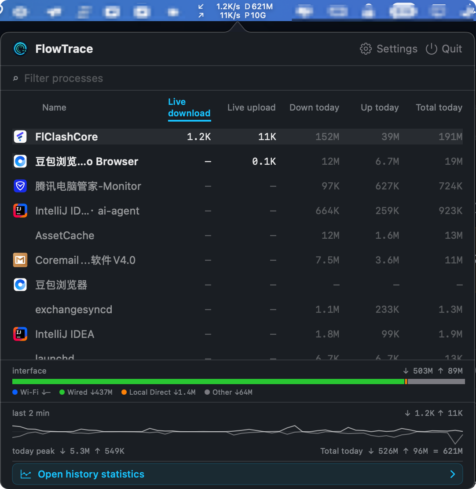
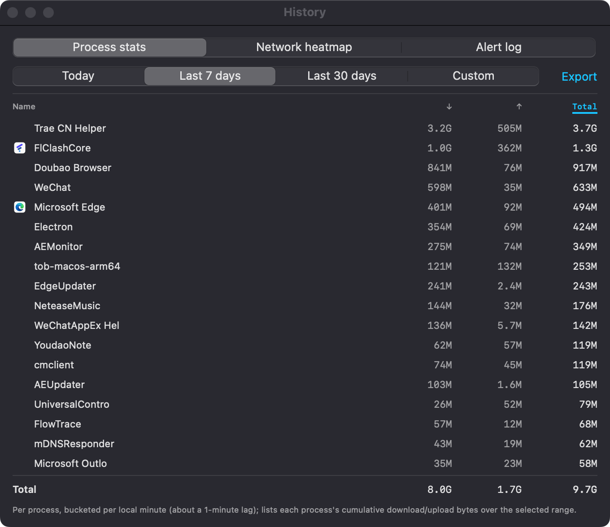
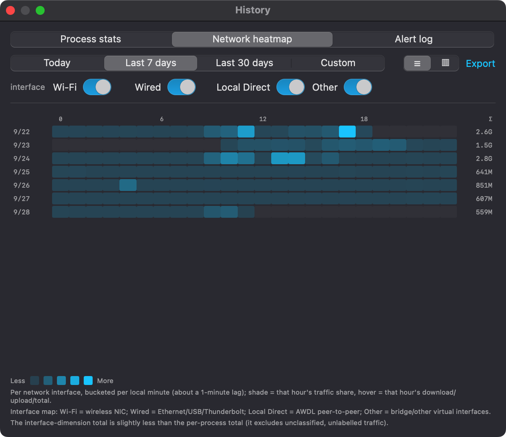
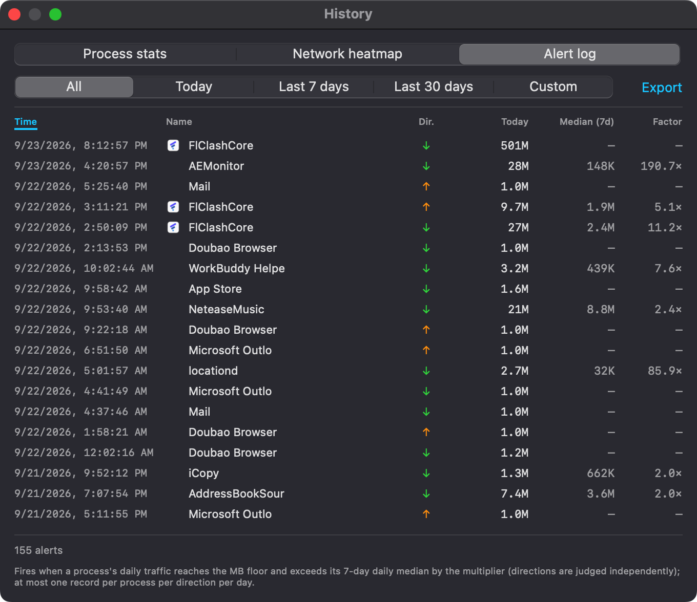
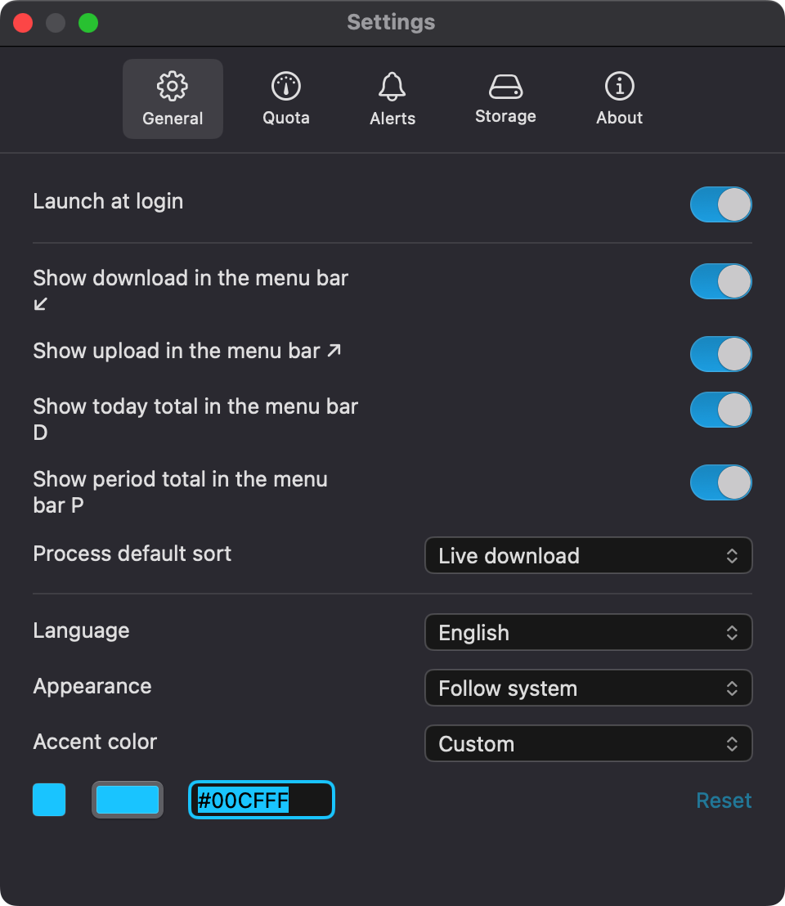
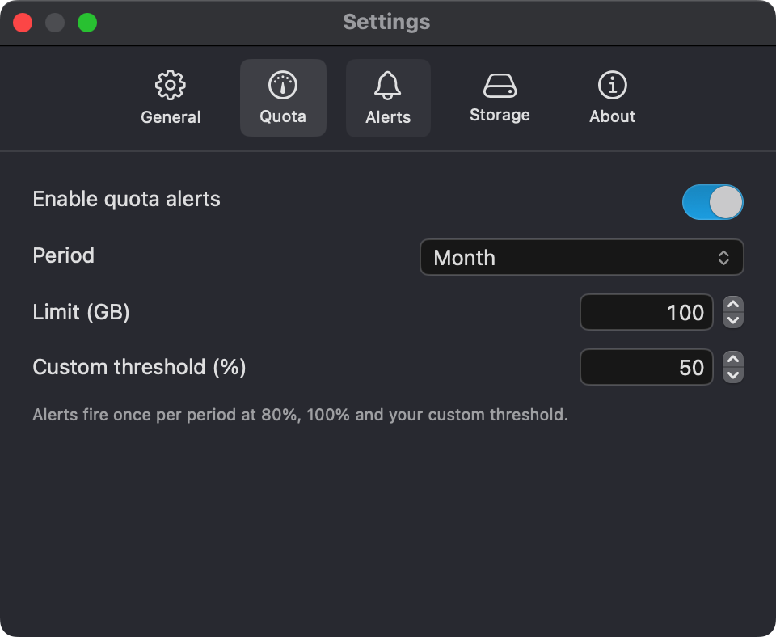
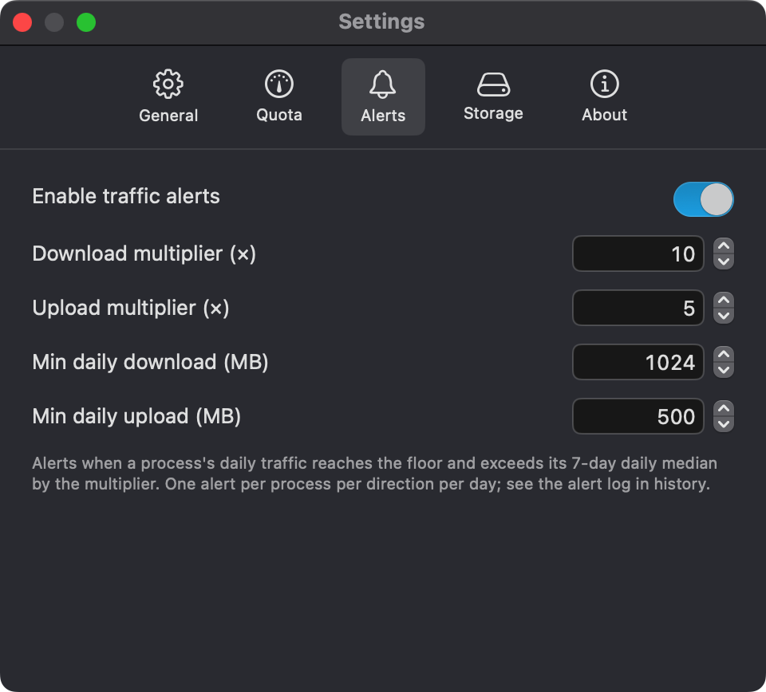
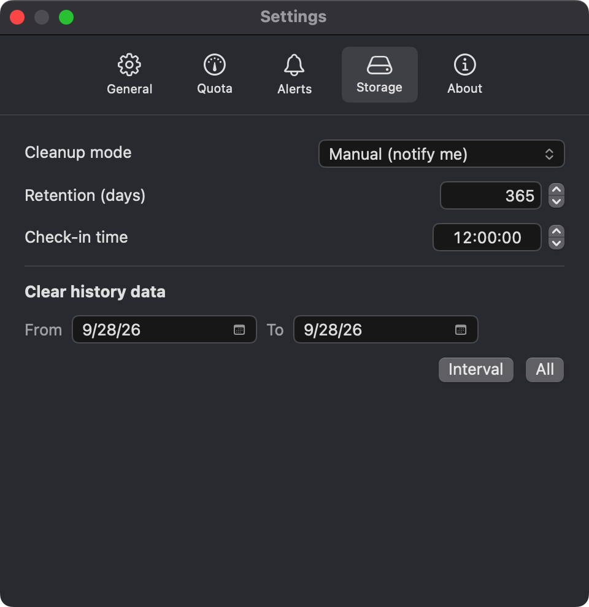
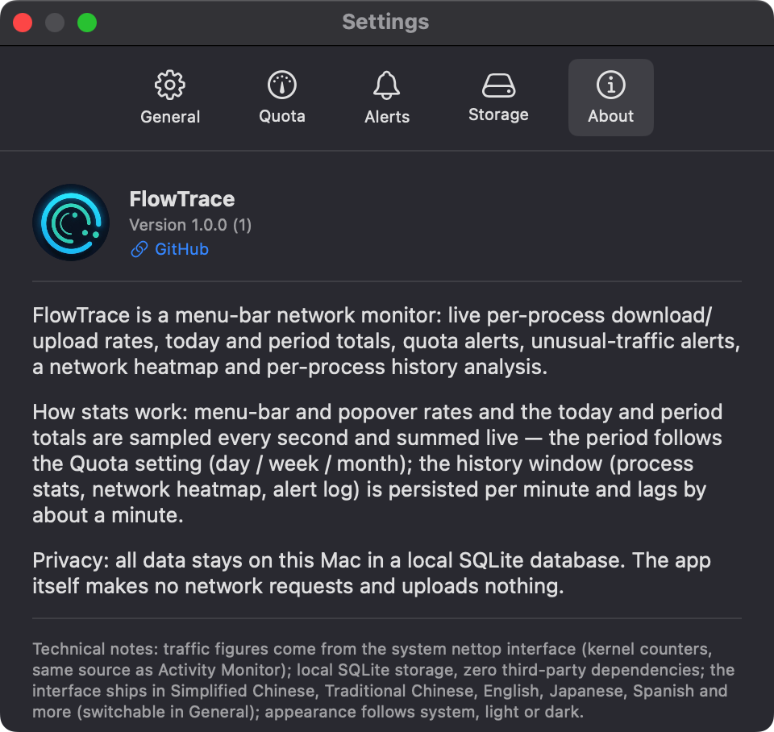

<div align="center">

# FlowTrace

🌐 **English** · **[中文](README.zh-CN.md)**

A macOS menu-bar network monitor: per-process upload and download in a popover, total rates in the status bar, sampled once a second from `/usr/bin/nettop`.

FlowTrace is a fork of [iTraffic](https://github.com/foamzou/ITraffic-monitor-for-mac). It keeps the upstream's approach — a small, per-process menu-bar monitor driving `nettop` — and adds process search, traffic history, an interface breakdown and the like on top. Credit for the original idea and for the `nettop` plumbing goes upstream; see [Credits](#credits).

</div>

**[Download the latest release](https://github.com/Dawson-Z/FlowTrace/releases)** — a `.dmg` (drag to Applications) or a `.zip`. Prefer to build it yourself? See [Building from source](#building-from-source).

The builds are signed with a self-signed certificate (the current signing identity is **`Dawson`**) and are **not notarised**, which means macOS will block the first launch until you allow it. [First launch](#first-launch) has the two-step. Everything works in user space: no System Extension, no NetworkExtension, no extra entitlements.

## Features

FlowTrace is a menu-bar network monitor. The live numbers are pulled from `/usr/bin/nettop` every second, persisted to a local SQLite database, and rolled up into the per-process view in the popover, the standalone history window, the settings window and the menu-bar status. Everything runs in user space — no System Extension, no NetworkExtension, no extra entitlements — and the app itself makes no network requests.

<p align="center">
  
</p>

- **Menu-bar status** — optional totals next to the live ↙/↗ rates: today (`D`) and the current quota period (`P`). No background activity of its own.
- **Process list popover** — per-process download / upload, today and period totals, six sort modes, name/PID search (case-insensitive), same-name process merge, and a live "today" column per row. The popover bottom carries the interface-overview strip (Wi-Fi / Wired / Local Direct / Other) and the last-two-minute history sparkline.
- **Standalone history window** — three panes: app-usage table (per-process, per-minute aggregation), hour × day network heatmap (hover a cell for download/upload/total), and abnormal-traffic alert log. Every pane reuses the same local database; all three export to CSV.
- **Interface dimension** — a second, independent `nettop` running in socket mode splits external traffic into Wi-Fi / Wired / Local Direct / Other, rendered as a stacked bar at the bottom of the popover.
- **Quota alerts** — local notifications at 80% / 100% / custom thresholds, grouped by month / week / day, deduplicated per threshold per period.
- **Per-process traffic alerts** — fires when today's traffic exceeds the process's 7-day daily median × the configured multiplier **and** a configurable absolute MB floor; deduplicated by local day + process + direction (a unique index in SQLite, so the no-double-fire rule survives restarts).
- **Retention with daily checkpoint** — configurable retention window, daily checkpoint at a configurable time. Mode can be automatic cleanup, or a local notification reminding the user to clear the data by hand. Editing any storage setting re-checks retention immediately (otherwise shrinking retention after the daily checkpoint had already run would silently wait).
- **Appearance follows system / light / dark** — pinned on the popover window too so it never goes out of sync with the chosen mode.
- **Accent colour** — Follow system, or custom `#RRGGBB`. Custom mode reaches hand-built controls where AppKit cannot be tinted (date / time pickers, accent picker, text fields); "Follow system" keeps the native focus ring and calendar popup.
- **21 languages** — runtime switching; numbers and dates format through the locale (German decimal separators etc.).

### Screenshots

| | |
|---|---|
|  |  |
| Per-process history · every minute aggregated, CSV-exportable | Hour × day traffic heatmap · hover a cell for download / upload / total |
|  |  |
| Abnormal-traffic alert log · deduplicated by day, process, direction | Settings · appearance, language, retention and more |
|  |  |
| Quota alerts at 80% / 100% / custom thresholds | Per-process traffic alerts with median + MB floor |
|  |  |
| Retention with daily checkpoint or manual reminder | About pane · version, privacy, project link |

## Install

Download `FlowTrace-<version>.dmg` or `FlowTrace-<version>.zip` from the [Releases page](https://github.com/Dawson-Z/FlowTrace/releases). The `.dmg` holds the app plus an alias to `/Applications`, so installing is drag-and-drop; the `.zip` is the same bundle without the disk image, for scripting.

### First launch

The builds are signed with a self-signed certificate, which is **not** the same thing as being notarised by Apple, and anything downloaded through a browser arrives with macOS's quarantine flag set. Gatekeeper therefore blocks the first launch. Depending on your macOS version the wording differs — any of these means the same thing:

- *"FlowTrace is damaged and can't be opened. You should move it to the Trash."* — despite the wording, nothing is damaged. The message is about the quarantine flag, not the file.
- *"FlowTrace can't be opened because it is from an unidentified developer."*
- *"FlowTrace cannot be opened because the developer cannot be verified."*

**Do not click "Move to Trash"** — the download is fine. There are two ways through, and which one applies depends on which wording you got.

**System Settings.** Open the app once so it gets blocked, dismiss the warning, then go to **System Settings → Privacy & Security** and scroll to the bottom. There will be a FlowTrace notice with an **Open Anyway** button; click it and authenticate. Two things catch people out:

- The notice only appears *after* a failed launch attempt, so opening the app first is not optional.
- The button disappears after about an hour. If you come back later it is gone — launch the app again to bring it back.

On macOS 11–14, right-clicking the app and choosing **Open → Open** achieves the same thing. Apple removed that shortcut in macOS 15, so the System Settings route is the one that works everywhere.

**Terminal**, for when there is no **Open Anyway** button — which is common with the "damaged" wording:

```bash
xattr -cr /Applications/FlowTrace.app
```

That clears the quarantine flag on the bundle and everything inside it. If the `.dmg` itself refuses to mount, run the same command on the disk image before opening it. Only do this for a download you trust, because it is you telling macOS to stop checking.

**This repeats on every update.** The approval is remembered for the copy you allowed, but a newly downloaded version arrives with a fresh quarantine flag and gets blocked again. If re-walking users through this on every release is more than you want to ask, notarisation is the fix — see the note below.

> **Why not notarised?** Notarisation requires a paid Apple Developer Program membership, which this project does not have yet. A self-signed certificate cannot be notarised — Apple only accepts Developer ID certificates — and it buys nothing at the Gatekeeper level: a self-signed build is blocked exactly as much as an unsigned one. See [AGENTS.md](AGENTS.md) for the upgrade plan. Notarisation would delete this whole section.

> **Which self-signed certificate?** The login keychain on this maintainer's machine has exactly one codesigning identity: `Dawson` (SHA-1 `BB1394A66CB92A22F19FCE4BA28735122D9807BD`). That same name is what `codesign -dv` will print as the `Authority` for every published build, and what `spctl -a -t exec` will print as `origin=`. If you compare one build against another and the Authority differs, somebody rebuilt with a different identity — that is *not* an upstream build, treat it as suspicious.

> **How to know it's a real release.** Every GitHub release lists the `.dmg` / `.zip` SHA-256 sums in its notes (the same ones are in [changelog/1.0.0.md](changelog/1.0.0.md)). After you've allowed the build, run `codesign -dv --verbose=4 FlowTrace.app` and confirm `Authority=Dawson`, then `shasum -a 256` the downloaded file.

### Updating

FlowTrace does **not** check for updates, and never will while [the no-network-requests rule](AGENTS.md) stands. The reasoning is the point of the app: it lists the network activity of every process including its own, so a background update poll would show up to the user as unexplained traffic from the one tool whose job is to explain traffic. Upstream's `UpdateChecker.swift` was stripped for exactly this reason.

Update by watching the Releases page and re-downloading the latest `.dmg` or `.zip`.

## Requirements

- macOS 11.0 or later — the deployment target, and the floor for `Logger` / `@StateObject` without `@available` guards.
- Xcode 16 or later, if building from source. XcodeGen emits `objectVersion = 77`, which older Xcodes refuse to open.
- [XcodeGen](https://github.com/yonaskolb/XcodeGen) — `brew install xcodegen`.

No third-party packages. The only non-system dependency is the system SQLite (`import SQLite3`).

## Building from source

```bash
brew install xcodegen
xcodegen generate
xcodebuild -project FlowTrace.xcodeproj -scheme FlowTrace -configuration Debug build
```

Or open `FlowTrace.xcodeproj` in Xcode and ⌘R. Output binary is `FlowTrace.app`.

`FlowTrace.xcodeproj` is generated and deliberately not committed, so a fresh clone needs the `xcodegen generate` step. Edit `project.yml`, never the project file.

Tests:

```bash
xcodebuild test -project FlowTrace.xcodeproj -scheme FlowTrace -configuration Debug
```

The suite covers the process-list comparator and merge, the frame parser, the quota crossing rule, the per-process alert rule, the interface classifier, both SQLite pipelines (per-app usage, interface heatmap), the read-only query surface, the settings store, the accent-colour parsing, the 21 localization tables, and the local-notification delivery contract. The test bundle injects its own `UserDefaults`, opens a temporary database, and stubs `NotificationDelivery`, so each test's *assertions* are clean.

A test run, however, is **not** isolated from your system: the bundle is hosted inside the app (`TEST_HOST`), so `applicationDidFinishLaunching` executes and the binary spawns the two real `nettop` subprocesses and reads/writes your real `~/Library/Application Support/FlowTrace/history.sqlite3` and `~/Library/Logs/FlowTrace.log`. Tests that go through `Loc` / `LocalizationManager.shared` will also instantiate `SettingsStore.shared`, which reads your real `UserDefaults` domain and may perform a one-time key migration there. To run the binary in a clean room, use `CFFIXED_USER_HOME=<dir>` — `HOME` alone does **not** work, because macOS resolves `NSHomeDirectory()` via `getpwuid()`.

## Layout

```
FlowTrace/                         fork-specific experiments
  Feature/Appearance/                accent-colour subsystem + hand-built controls
  Feature/History/                   ring buffer, SQLite persistence, history
                                     window (app usage / heatmap / alerts), CSV
  Feature/Interface/                 per-interface-category sampling + overview
  Feature/Localization/              runtime locale resolver (Loc.l)
  Feature/Logging/                   os.Logger + file sink (Log.* helpers)
  Feature/Search/                    process search
  Feature/Settings/                  SettingsStore, settings window, retention,
                                     data cleaner, launch at login
  Feature/Usage/                     period totals, quota alerts, process alerts,
                                     local-notification delivery
FlowTraceForMac/                   upstream-derived app sources (several touched
                                   by this fork — see AGENTS.md)
  Service/NettopRunner.swift       drives /usr/bin/nettop
  Network.swift                    parses frames, feeds the models
  Model/                           ObservableObjects backing the two surfaces
  ContentView.swift                popover: header + process list
  StatusBarView.swift              menu-bar rates
docs/ARCHITECTURE.md               architecture + per-file reference
project.yml                        XcodeGen source of truth
changelog/<version>.md             release notes (English)
changelog/<version>.zh-CN.md       release notes (Simplified Chinese)
```

## Credits

FlowTrace builds on [foamzou/ITraffic-monitor-for-mac](https://github.com/foamzou/ITraffic-monitor-for-mac) — *iTraffic*, the original per-process macOS menu-bar network monitor. The idea itself, the popover/menu-bar split, the 1-second delta sampling rule, and the two non-obvious tricks that make driving `/usr/bin/nettop` from an app work at all all come from there. Thanks to foamzou and the upstream contributors.

## License

[MIT](LICENSE). The upstream iTraffic is MIT-licensed as well, and this fork keeps that licence and its original copyright notice alongside its own.
