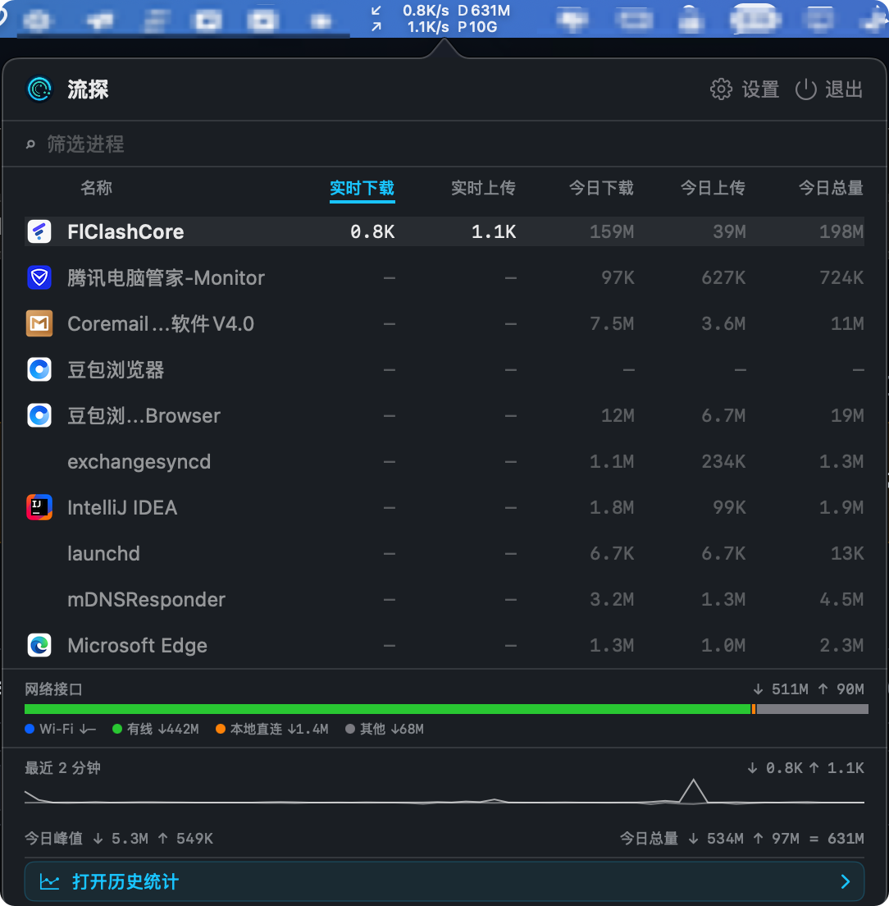
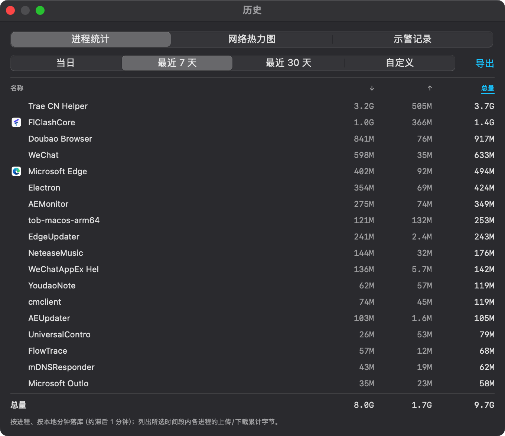
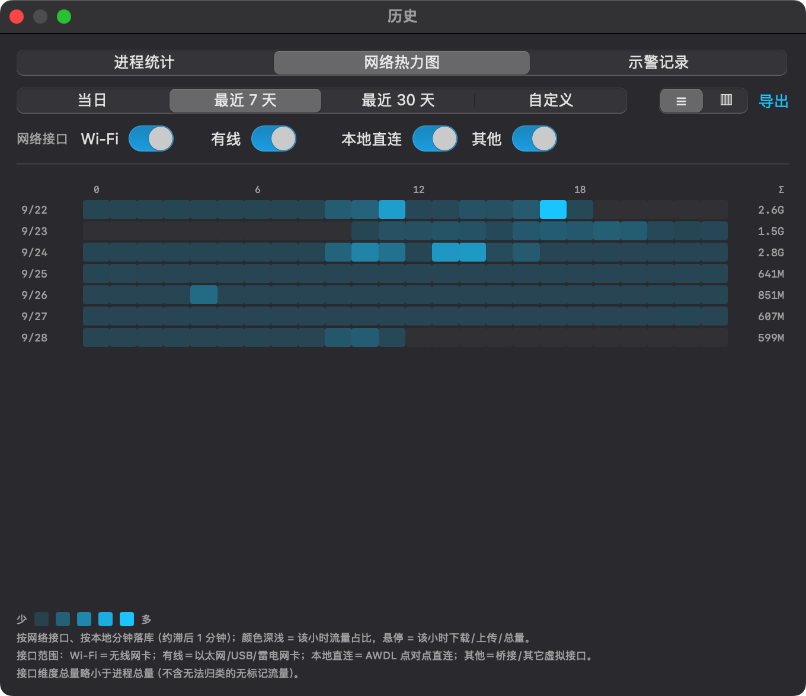
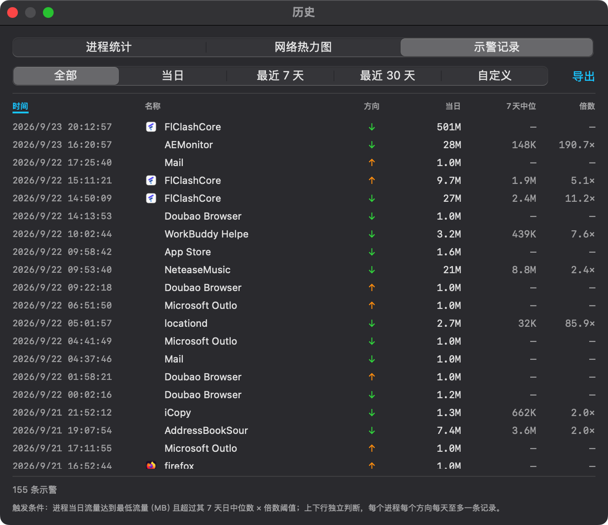
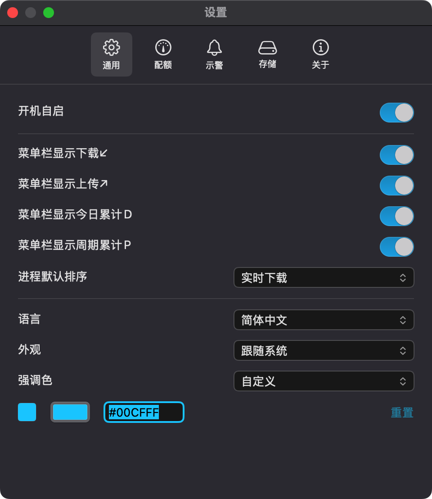
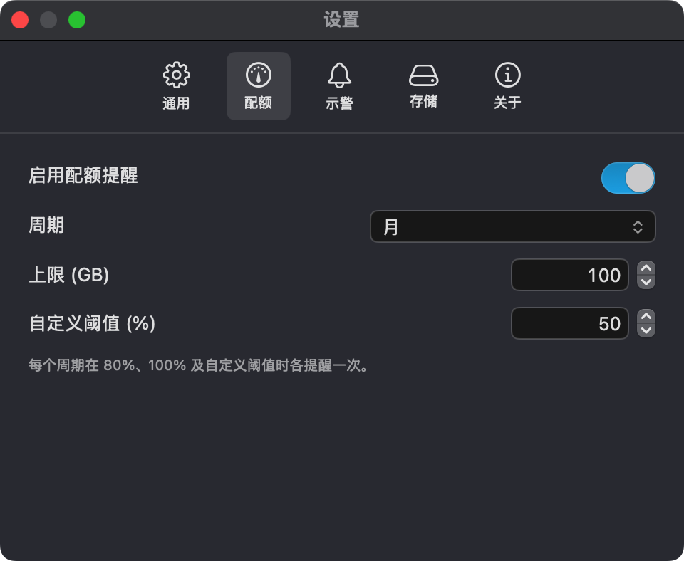
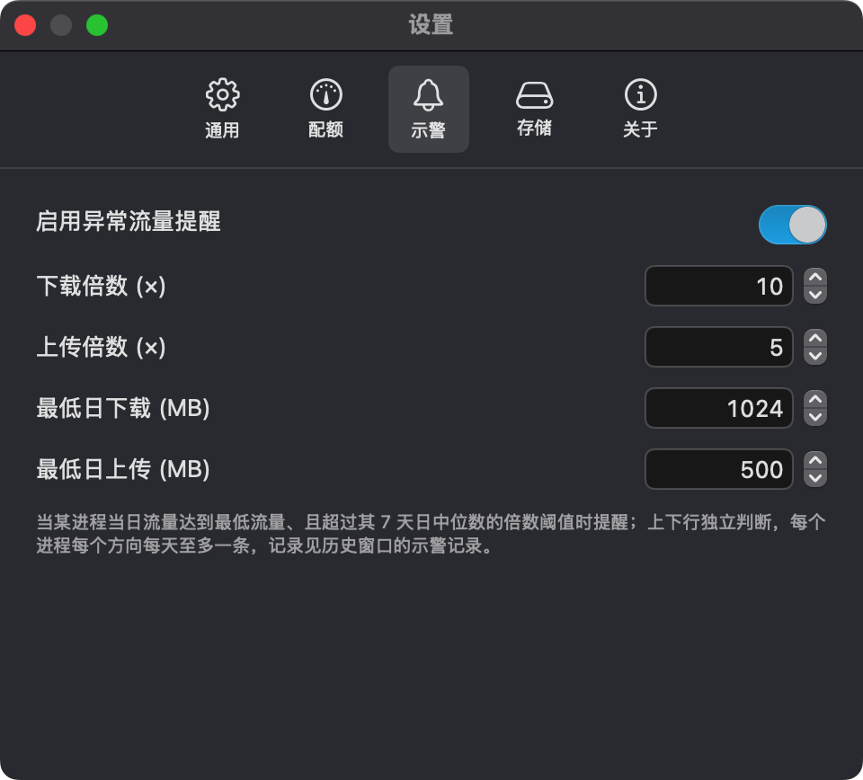
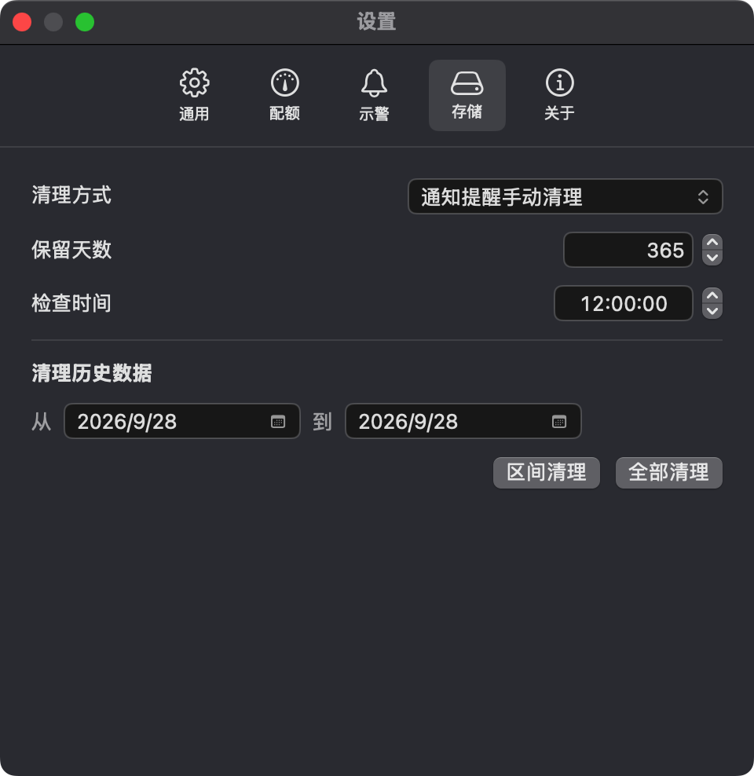
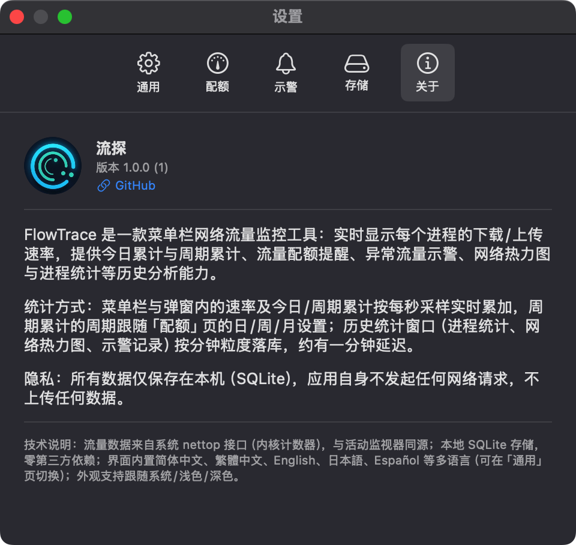

<div align="center">

# FlowTrace（中文说明）

🌐 **[English](README.md)** · **中文**

一个 macOS 菜单栏网络监控器：popover 里显示按进程的上传/下载，状态栏显示总速率，每秒从
`/usr/bin/nettop` 采样一次。

FlowTrace 是 [iTraffic](https://github.com/foamzou/ITraffic-monitor-for-mac) 的分支。
它保留上游的形态 —— 一个小的、按进程维度的菜单栏监控器，驱动 `nettop` —— 并在其上叠加了
进程搜索、流量历史、接口维度等特性。原始构思与 `nettop` 那套接线的功劳都在上游，见
[致谢](#致谢)。

</div>

**[下载最新发布版](https://github.com/Dawson-Z/FlowTrace/releases)** —— `.dmg`（拖进 Applications 即装完）或 `.zip`。想自己编译的话见[从源码构建](#从源码构建)。

发布包用自签名证书签名（**当前签名身份是 `Dawson`**）、**未经公证**，所以 macOS 首次会拦下它。[首次启动](#首次启动) 写了放行步骤。所有功能都在用户态完成；没有 System Extension，没有 NetworkExtension，没有额外的 entitlements。

## 功能介绍

FlowTrace 是一款菜单栏网络流量监控工具。速率数据来自 `/usr/bin/nettop`，每秒钟采样一次，落本地 SQLite 数据库，并按进程维度汇总到弹窗、设置窗、历史窗与菜单栏状态里。所有功能都在用户态完成 —— 没有 System Extension、没有 NetworkExtension、没有额外的 entitlements，应用自身也不发起任何网络请求。

<p align="center">
  
</p>

- **菜单栏状态** —— 速率 ↙/↗ 旁边可选挂今日累计 `D` 与当前配额周期 `P`。应用自身无任何后台活动。
- **进程列表弹窗** —— 按进程的上传/下载、今日累计与周期累计、6 种排序模式、按名称/PID 搜索（忽略大小写）、同名进程合并，每行实时显示「今日」列。弹窗底部是接口概览条（Wi-Fi / 有线 / 本地直连 / 其他）和最近 2 分钟的速率小曲线图。
- **独立历史窗口** —— 三栏：应用用量表（按进程、按分钟聚合）、小时 × 天网络热力图（悬停查看下载/上传/总量）、异常流量示警日志。三栏共用本地数据库，三栏都能导出 CSV。
- **接口维度** —— 第二个独立 nettop 以 socket 模式运行，把外部流量切成 Wi-Fi / 有线 / 本地直连 / 其他，弹窗底部以堆叠条形式展示。
- **配额示警** —— 80% / 100% / 自定义阈值的本地通知，按月/周/日分组，阈值与周期双重去重。
- **进程流量示警** —— 当日流量同时满足「超过该进程 7 日日中位数 × 倍数」与「绝对 MB 下限」时触发；按本地日 + 进程 + 方向去重（SQLite 唯一索引，重启天然保持不重发）。
- **保留期与每日检查点** —— 可配置保留窗口与每日检查时间。清理方式可选自动删除，或本地通知提醒手动清理。修改任一存储设置都会立即重查保留期（否则「检查点跑完后才改小保留天数」会静默等到第二天）。
- **外观跟随系统/浅色/深色** —— 弹窗窗口也强制同步，避免缓存窗口与所选外观不一致。
- **强调色** —— 跟随系统，或填入自定义 `#RRGGBB`。自定义模式着色到 AppKit 无法着色的手绘控件（日期/时间选择器、强调色下拉、文本框）；「跟随系统」保留原生焦点环与日历弹窗。
- **21 种语言** —— 运行时切换；数值与日期跟随 locale 格式化（德语小数点等）。

### 截图

| | |
|---|---|
|  |  |
| 进程历史 · 按分钟聚合，可导出 CSV | 小时×天流量热力图 · 悬停查看下载/上传/总量 |
|  |  |
| 异常流量示警日志 · 按日、进程、方向去重 | 设置 · 外观、语言、保留期等 |
|  |  |
| 配额示警：80% / 100% / 自定义阈值 | 进程流量告警：中位数 × 倍数 + 绝对 MB 下限 |
|  |  |
| 保留期 · 每日检查点或手动提醒 | 关于页 · 版本、隐私、项目链接 |

## 安装

从 [Releases 页](https://github.com/Dawson-Z/FlowTrace/releases) 下载 `FlowTrace-<版本>.dmg` 或
`FlowTrace-<版本>.zip`。`.dmg` 里是 app 加一个指向 `/Applications` 的替身，拖进去就装完了；
`.zip` 是同一个 bundle 去掉磁盘映像，给脚本用。

### 首次启动

发布包用自签名证书签名，这和「经 Apple 公证」**不是**一回事；而任何经浏览器下载的文件都带着 macOS
的 quarantine 标记。所以 Gatekeeper 会拦下首次启动。文案随系统版本不同，下面任意一种都是同一件事：

- *「FlowTrace 已损坏，无法打开。你应该将它移到废纸篓。」* —— 尽管字面这么说，文件完好无损。这条
  提示说的是 quarantine 标记，不是文件本身。
- *「无法打开 FlowTrace，因为它来自未识别的开发者。」*
- *「无法打开 FlowTrace，因为无法验证开发者。」*

**千万不要点「移到废纸篓」** —— 下载是好的。有两条路可以过，能走哪条取决于你看到的是哪句文案。

**系统设置。** 先打开一次 app 让它被拦下，关掉警告，然后去**系统设置 → 隐私与安全性**滚到底部。那里
会出现一条 FlowTrace 的提示，旁边是**仍要打开**按钮，点它并验证身份。有两个坑：

- 那条记录**只在一次失败启动之后**才出现，所以「先打开一次」这一步不能省。
- 这个按钮大约 **1 小时后消失**。你要是过一阵子才回来，它已经没了 —— 再启动一次 app 就会重新出现。

macOS 11–14 上，右键点 app 选**打开 → 打开**效果相同。Apple 在 macOS 15 移除了该快捷方式，所以系统
设置那条才是各版本通用的。

**终端**，用于没有**仍要打开**按钮的情况（「已损坏」那种措辞就常常没有）：

```bash
xattr -cr /Applications/FlowTrace.app
```

这会清掉 bundle 及其内部所有内容的 quarantine 标记。如果 `.dmg` 本身挂载不上，就先对磁盘映像跑同一条
命令再打开。只对你信任的下载这么做，因为这等于你告诉 macOS 不必再检查。

**每次更新都会重来一遍。** 授权是记在「你放行的那一份」上的，而新下载的版本带着全新的 quarantine
标记，会再被拦一次。如果每个版本都要让用户重走这套流程超出了你愿意要求的范围，那解法就是公证 ——
见下面的说明。

> **为什么没公证？** 公证需要付费加入 Apple Developer Program，本项目目前没有。自签名证书也无法
> 公证 —— Apple 只接受 Developer ID 证书 —— 而且在 Gatekeeper 层面它一点忙都帮不上：自签名的包和
> 完全未签名的包被拦的程度**一模一样**。升级计划见 [AGENTS.md](AGENTS.md)；一旦公证，上面这一整节
> 就可以删掉。
>
> **用的是哪把自签名身份？** 维护者登录钥匙链里只有一把 codesigning 身份：`Dawson`
> （SHA-1 `BB1394A66CB92A22F19FCE4BA28735122D9807BD`）。所有发布构建的 `codesign -dv` 都会以这个名字作为
> `Authority`、`spctl -a -t exec` 会以它作为 `origin=`。如果对比两个构建发现 Authority 不同，
> 说明有人用了别的身份重新签 —— 那**不是**上游构建，请当作可疑来源处理。
>
> **怎么确认你拿到的就是真发布版？** 每个 GitHub Release 的 notes 里都列了 `.dmg` / `.zip` 的 SHA-256
> （与 [changelog/1.0.0.zh-CN.md](changelog/1.0.0.zh-CN.md) 里的一致）。放行安装后，
> 跑 `codesign -dv --verbose=4 FlowTrace.app` 确认 `Authority=Dawson`，再用 `shasum -a 256` 对比下载文件。

### 更新

FlowTrace **不检查更新**，只要[零网络请求那条规则](AGENTS.md)还在，就永远不会检查。理由就是这
个 app 本身：它会列出每个进程（包括它自己）的网络活动，所以后台的更新轮询在用户眼里就是「一个
专门用来解释流量的工具产生的、无法解释的流量」。上游的 `UpdateChecker.swift` 正是因为这个原因被
移除的。

更新方式：盯着 Releases 页，重新下载最新的 `.dmg` 或 `.zip`。

## 环境要求

- macOS 11.0 或更高 —— 部署目标，也是 `Logger` / `@StateObject` 无需 `@available` 守卫的下限。
- Xcode 16 或更高（从源码构建时需要）。XcodeGen 生成的是 `objectVersion = 77`，更老的 Xcode 打不开。
- [XcodeGen](https://github.com/yonaskolb/XcodeGen) —— `brew install xcodegen`。

零第三方包。唯一的非系统依赖是系统自带的 SQLite（`import SQLite3`）。

## 从源码构建

```bash
brew install xcodegen
xcodegen generate
xcodebuild -project FlowTrace.xcodeproj -scheme FlowTrace -configuration Debug build
```

或者在 Xcode 里打开 `FlowTrace.xcodeproj` 按 ⌘R。产物是 `FlowTrace.app`。

`FlowTrace.xcodeproj` 是生成物、有意不入库，所以新 clone 必须先跑 `xcodegen generate`。请改
`project.yml`，永远不要改工程文件。

测试：

```bash
xcodebuild test -project FlowTrace.xcodeproj -scheme FlowTrace -configuration Debug
```

测试覆盖进程列表的比较器与合并、帧解析器、配额跨越判定、进程告警判定、接口分类器、两条 SQLite 管线
（按应用用量、接口热力图）、只读查询面、设置存储、强调色解析、21 种语言字符串表，以及本地通知投递契约。
测试包注入自己的 `UserDefaults`、打开临时数据库、并 stub 掉 `NotificationDelivery`，所以每条用例的**断言**
是干净的。

但是，测试运行**并不与你的系统隔离**：测试包跑在 app **内部**（`TEST_HOST`），所以 `applicationDidFinishLaunching`
会真的执行，进程会拉起两个真实的 `nettop` 子进程，并读写真实的
`~/Library/Application Support/FlowTrace/history.sqlite3` 与 `~/Library/Logs/FlowTrace.log`。任何经过
`Loc` / `LocalizationManager.shared` 的用例还会实例化 `SettingsStore.shared`，从而读取你真实的
`UserDefaults` 域，并可能在其中执行一次性 key 迁移。要在一个干净的环境里跑构建产物，用
`CFFIXED_USER_HOME=<dir>` 启动 —— 只设 `HOME` **不行**，因为 macOS 的 `NSHomeDirectory()` 走
`getpwuid()`。

## 目录布局

```
FlowTrace/                         分支自有实验
  Feature/Appearance/                强调色子系统 + 手绘控件
  Feature/History/                   环形缓冲、SQLite 持久化、历史窗口
                                     (app usage / heatmap / alerts)、CSV
  Feature/Interface/                 按接口类别采样 + 概览
  Feature/Localization/              运行时 locale 解析器（Loc.l）
  Feature/Logging/                   os.Logger + 文件 sink（Log.* 帮助器）
  Feature/Search/                    进程搜索
  Feature/Settings/                  SettingsStore、设置窗口、保留、
                                     数据清理、开机自启
  Feature/Usage/                     周期总量、配额提醒、进程告警、
                                     本地通知投递
FlowTraceForMac/                   上游继承的应用源码（本分支改动过一些，
                                   见 AGENTS.md）
  Service/NettopRunner.swift       驱动 /usr/bin/nettop
  Network.swift                    解析帧、喂入模型
  Model/                           支撑两个 surface 的 ObservableObject
  ContentView.swift                popover：头部 + 进程列表
  StatusBarView.swift              菜单栏速率
docs/ARCHITECTURE.md               架构 + 逐文件参考
project.yml                        XcodeGen 唯一事实来源
changelog/<version>.md             release notes（英文）
changelog/<version>.zh-CN.md       release notes（简体中文）
```

## 致谢

FlowTrace 基于 [foamzou/ITraffic-monitor-for-mac](https://github.com/foamzou/ITraffic-monitor-for-mac)
（*iTraffic*）—— 最初的按进程 macOS 菜单栏网络监控器。构思本身、popover / 菜单栏的分工、
1 秒 delta 采样规则，以及让「从 app 驱动 `/usr/bin/nettop`」真正跑起来的那两个不起眼的兜底，
都来自上游。感谢 foamzou 与上游的贡献者。

## 许可

[MIT](LICENSE)。上游 iTraffic 同样是 MIT 许可，本分支沿用同一许可，并保留其原始版权行。
